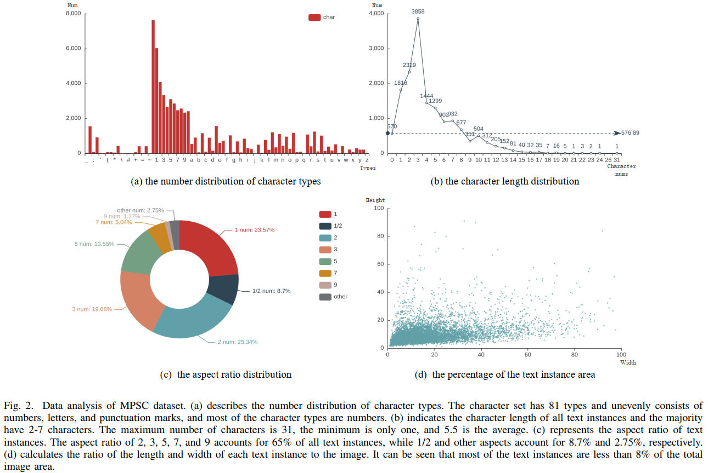
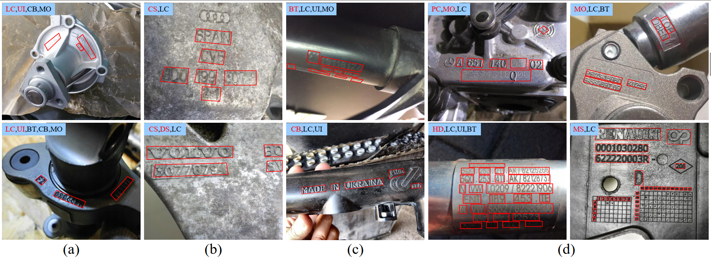

# MPSC

The Metal Part Surface Character (MPSC) dataset contains 2555 training images and 639 testing images. 

The detailed data analysis is shown as follows:


The MPSC dataset provides high-quality ground-truth boxes and text transcriptions. Most of them contain special combination rules that are different from the legal spelling of words, such as ”AlSi9Cu3”, ”D151C-050506”, and ”7M121”.

Also, our datasets bring many new challenges affected by the following factors: 


(a) Metal properties, industrial text detectors should consider the challenges of low visual contrast (LC) and uneven illumination (UI) on parts due to metal materials.
(b) Industrial circumstances, the parts appear corroded surfaces (CS) and dirty surfaces (DS) due to the influence of weather and humidity in the production workshop.
(c) Scene noise, unconstrained motion shooting produces blur texts (BT) and introduces an industrial complex background (CB).
(d) Artificial design, product information is mainly presented on metal parts in multiple forms, including multi-direction (MO), multi-scale (MS), high-density (HD), and polymorphic characters (PC).

The dataset and annotations are now avaiable from [Disk](https://pan.baidu.com/s/17ti8kPivnlN9JSwCeOcPsw).

# SynthMPSC

The SynthMPSC dataset is an extension of the MPSC dataset, containing 98962 images and 1933234 text instances. 

This dataset and annotations can be obtained from [Disk](https://pan.baidu.com/s/104XqEYYV8S-68MH9PJeWWw).
  
# Cite
```bash
  If you used this dataset, please cite the following paper (Early Access):
  @ARTICLE{9726175,
    author={Guan, Tongkun and Gu, Chaochen and Lu, Changsheng and Tu, Jingzheng and Feng, Qi and Wu, Kaijie and Guan, Xinping},
    journal={IEEE Transactions on Circuits and Systems for Video Technology}, 
    title={Industrial Scene Text Detection with Refined Feature-attentive Network}, 
    year={2022},
    volume={},
    number={},
    pages={},
    doi={10.1109/TCSVT.2022.3156390}}
```

[comment]: <> (  ###The extraction code of dataset links is "sgtk".)
## License
```bash
- This dataset (MPSC and SynthMPSC) are only free for academic research purposes and licensed under the CC BY-NC 4.0 License.
```
<a rel="license" href="http://creativecommons.org/licenses/by-nc/4.0/"></a><br />本作品采用<a rel="license" href="http://creativecommons.org/licenses/by-nc/4.0/">知识共享署名-非商业性使用 4.0 国际许可协议</a>进行许可。
